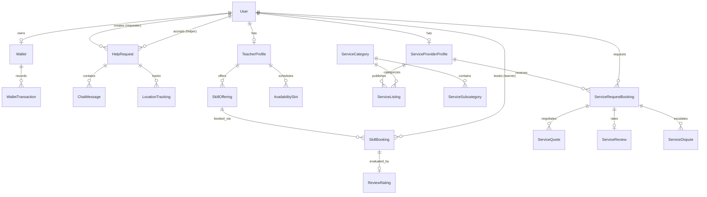
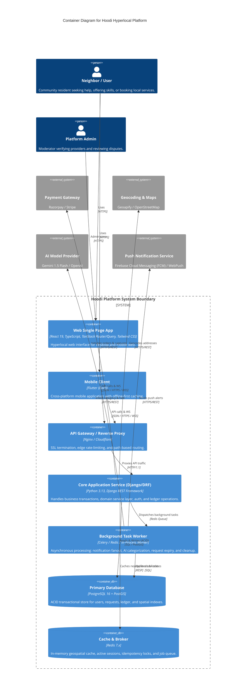
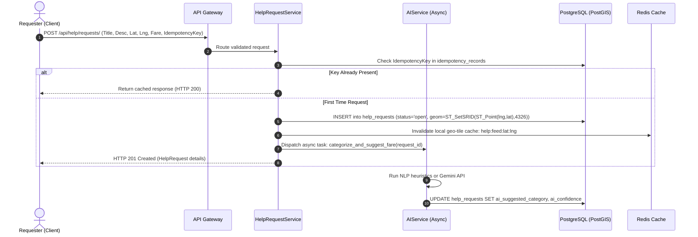
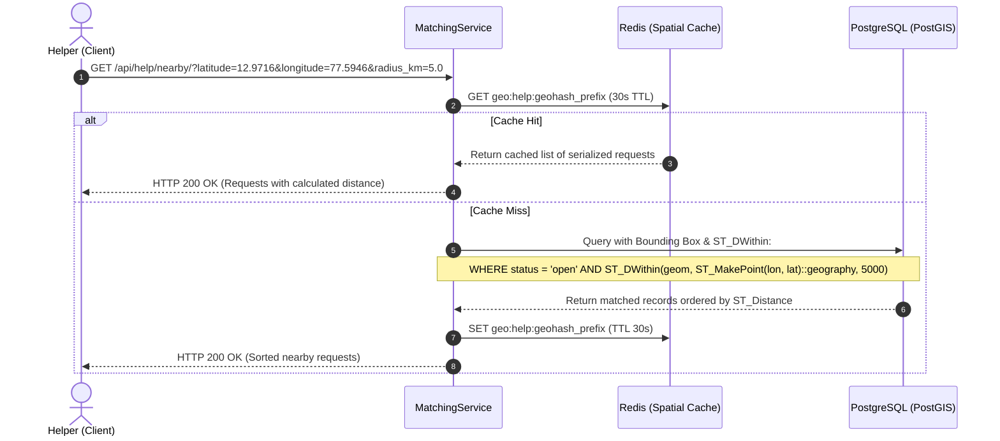
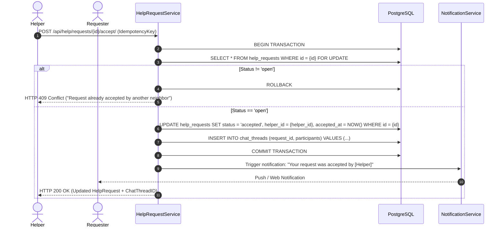
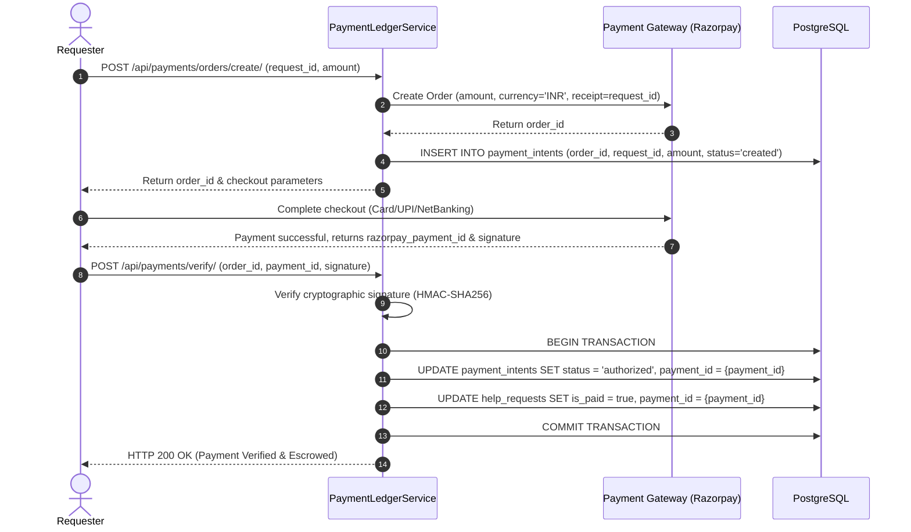
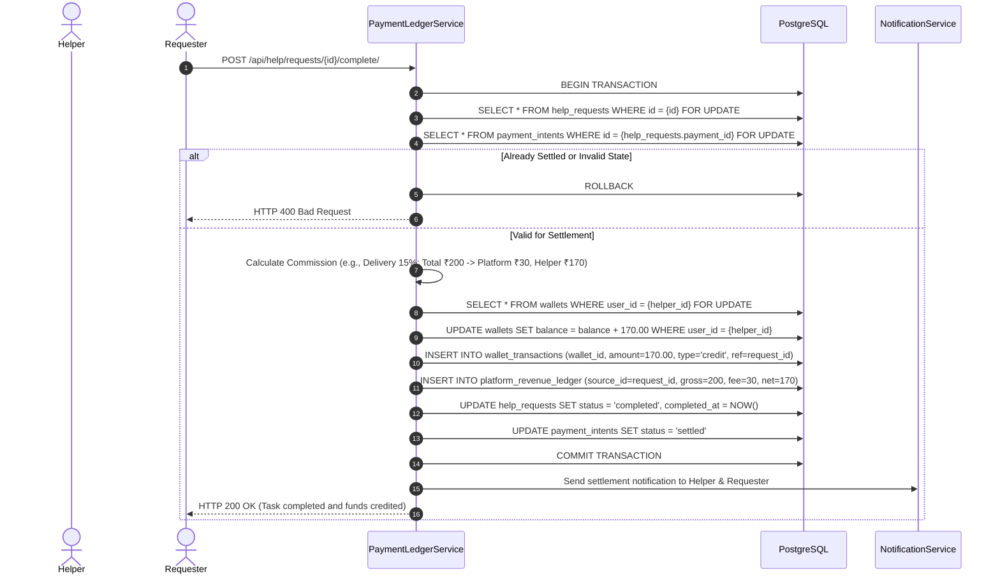
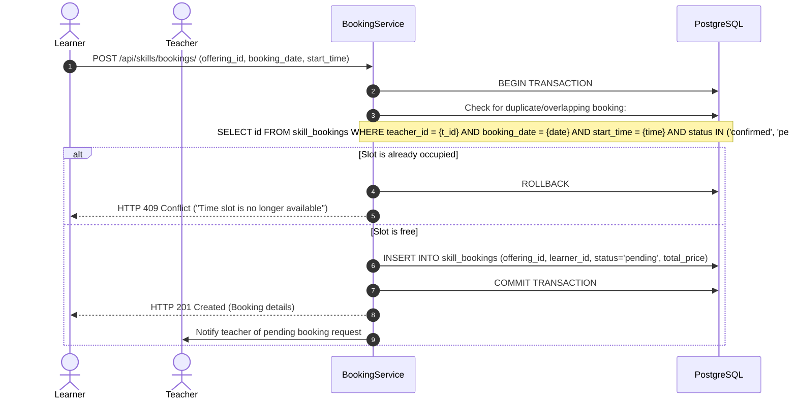
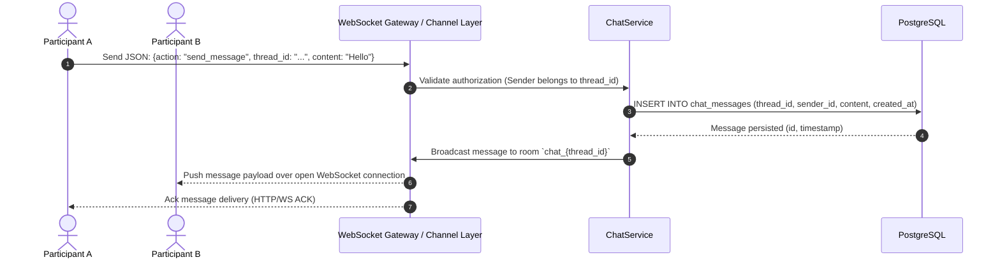
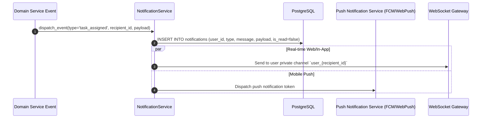

# Hoodi — System Design & Architecture Specification

> **Version:** 1.0.0  
> **Status:** Architecture Blueprint (Draft for Review — Pre-Implementation)  
> **Target System:** Hyperlocal Community & Mutual Aid Platform (Errands, Services, P2P Skills, Wallets)  
> **Date:** September 2026  

---

## 1. Executive Summary & System Context

**Hoodi** is a hyperlocal mutual-aid and service marketplace platform connecting neighbors within tightly bounded geographic radiuses (typically $\le 5\text{ km}$). The platform facilitates:
1. **Hoodi Help**: Immediate neighborhood errands, delivery, and urgent physical assistance.
2. **Hoodi Skills**: Peer-to-peer lesson discovery, slot scheduling, and skill exchange.
3. **Hoodi Services**: Local home and trade services (plumbing, electrical, cleaning) with quoting, itemized pricing, and reviews.
4. **Hoodi Financials**: In-platform closed-loop wallet, simulated/integrated payment gateway capture, platform commission deduction (10%–20%), and payout settlement.

This document serves as the comprehensive **System Design Blueprint** for the Hoodi ecosystem, grounded entirely in the active codebase.

---

## 2. Current "As-Is" Architecture Audit (Existing Codebase Inspection)

### 2.1 Current Architecture & The Dual-Stack Topology
The current repository exhibits a **hybrid/dual-backend split**:
* **Backend Subsystem (`backend/`)**: Built on **Django 6.1.1 + Django REST Framework 3.18.1** running on Python 3.13, backed by **SQLite (`backend/db.sqlite3`)**. It exposes REST endpoints under `/api/` with JWT authentication and OpenAPI schema generation (`drf-spectacular`).
* **Frontend Subsystem (`frontend/`)**: Built with **TanStack Start (React 19, TypeScript, Vite)**. Rather than solely consuming the Django API, its server functions (`frontend/src/lib/hoodi/*.functions.ts`) connect via `@supabase/supabase-js` directly to a remote **Supabase (PostgreSQL 14.5)** database.
* **Mobile Subsystem (`mobile/`)**: Cross-platform **Flutter** application configured with `supabase_flutter` pointing directly to Supabase (`SupabaseConstants.supabaseUrl`).

```
[Current Dual-Stack Reality]
┌────────────────┐     Direct BaaS (PostgREST / CDC)     ┌────────────────────────┐
│ Flutter Mobile │──────────────────────────────────────▶│                        │
└────────────────┘                                       │   Supabase Cloud       │
                                                         │   (PostgreSQL 14.5)    │
┌────────────────┐     TanStack Server Functions / BaaS  │   - Auth / RLS         │
│ React Frontend │──────────────────────────────────────▶│   - RPCs / Triggers    │
└────────────────┘                                       └────────────────────────┘
        │
        │ [Intended / Parallel API Client]
        ▼
┌────────────────────────────────────────────────────────┐
│ Django 6.x REST API (Port 8000)                        │
│ - accounts, help_requests, skills, payments, services  │
│ - Storage: Local SQLite (db.sqlite3)                   │
└────────────────────────────────────────────────────────┘
```

---

### 2.2 Current Frontend/Backend Communication
1. **Frontend to Data Layer**: The React web client executes TanStack Start Server Functions (`createServerFn({ method: "POST" | "GET" })`). These functions run server-side, validate payloads with **Zod**, verify session tokens via `requireSupabaseAuth` middleware, and execute queries via PostgREST or direct SQL RPCs (`accept_help_request`, `capture_payment`).
2. **Django Endpoints**: Exposes standard JSON REST endpoints (`/api/auth/`, `/api/help/`, `/api/skills/`, `/api/payments/`, `/api/ai/`, `/api/services/`). Serializers are standard DRF `ModelSerializer`. There is currently **no active reverse-proxy or API Gateway routing** between TanStack Start and Django in local configuration.
3. **Serialization & Type Safety**:
   * Web: Strongly typed via `supabase/types.ts` (101 KB generated TypeScript schema) and Zod input validators.
   * Django: DRF serializers validate types and basic constraints, but lack strict runtime schema contract tests against the frontend TypeScript types.

---

### 2.3 Existing Authentication and Authorization
* **Django Tier**: Uses `rest_framework_simplejwt`. Users authenticate with `email` and `password` at `/api/auth/token/`. Tokens are issued as Bearer JWT (`ACCESS_TOKEN_LIFETIME = 1 day`, `REFRESH_TOKEN_LIFETIME = 7 days`). Authorization relies on DRF `IsAuthenticated`, `IsAdminUser`, or `AllowAny`.
* **Supabase / Client Tier**: Uses Supabase GoTrue Auth. JWT tokens are verified server-side in `auth-middleware.ts` by calling `supabase.auth.getUser(token)`.
* **Role Invariants**: Role flags exist on the user (`is_verified`, `is_helper`, `is_teacher`, `is_admin_user`, `is_verified_provider`). In Django views, permissions are checked via basic `if request.user not in (req.requester, req.helper)` checks.

---

### 2.4 Existing Help Architecture
* **Models**: `HelpRequest`, `ChatMessage`, `LocationTracking`.
* **Statuses**: `open` $\to$ `accepted` $\to$ `in_progress` $\to$ `completed` | `cancelled`.
* **Categories**: `delivery`, `home_assistance`, `transport`, `other`.
* **Urgencies**: `low`, `normal`, `high`, `critical`.
* **Critical Flaw in Acceptance**: In `help_requests/views.py`:
  ```python
  help_req = HelpRequest.objects.get(pk=pk)
  if help_req.status != "open":
      return Response({"error": "Request is not open"}, status=400)
  help_req.helper = request.user
  help_req.status = "accepted"
  help_req.save()
  ```
  **Race Condition**: There is no database lock (`select_for_update`), no atomic transaction wrapper, and no conditional compare-and-swap (`UPDATE WHERE status = 'open'`). Two concurrent helper requests will both read `status == 'open'`, causing double acceptance.

---

### 2.5 Existing Skills Architecture
* **Models**: `TeacherProfile`, `SkillOffering`, `AvailabilitySlot`, `SkillBooking`, `ReviewRating`.
* **Flow**:
  1. User registers as teacher (`TeacherProfile` created, `user.is_teacher = True`).
  2. Teacher creates `SkillOffering` (category, price, duration, is_online, is_in_person).
  3. Learner books via `SkillBooking` (`pending` $\to$ `confirmed` $\to$ `completed` | `cancelled`).
* **Limitations**: Slots are defined simply by `day_of_week`, `start_time`, `end_time`. There is **no calendar slot conflict collision detection**; overlapping bookings for the exact same date and time can be created concurrently.

---

### 2.6 Existing Payment / Wallet Architecture
* **Models**: `Wallet` (1:1 with `User`, `balance`), `WalletTransaction` (`amount`, `transaction_type` [credit/debit], `reference_id`).
* **Simulation Logic**:
  * Commission rates: `delivery` = 15%, `transport` = 15%, `home_assistance` = 10%, `skills` = 20%.
  * `SimulatePaymentView` in `payments/views.py`:
    ```python
    wallet, _ = Wallet.objects.get_or_create(user=recipient)
    wallet.balance += net_credit
    wallet.save()
    WalletTransaction.objects.create(...)
    ```
* **Critical Vulnerabilities**:
  1. **Lost Updates**: In-memory balance mutation without `F('balance') + net_credit` or `select_for_update()` causes balance overwrites under concurrent transactions.
  2. **Non-Atomic Operations**: Wallet credit and transaction log creation are not enclosed in a database transaction (`transaction.atomic()`).
  3. **No Idempotency Keys**: Network retries will double-credit wallets.
  4. **Unbalanced Ledger**: Requester wallets are not debited; money is created *ex nihilo*.

---

### 2.7 Existing Chat and Real-Time Architecture
* **Django**: Plain HTTP endpoints (`ChatMessageListCreateView`, `LocationTrackingView`). Clients must poll via `GET` to receive updates.
* **Frontend**: Subscribes to Supabase Realtime using WebSocket channels:
  ```typescript
  supabase.channel(`request_realtime_${id}`)
    .on('postgres_changes', { event: '*', schema: 'public', table: 'help_requests', filter: `id=eq.${id}` }, ...)
  ```
  Also maintains a polling fallback (`refetchInterval: 5_000`).

---

### 2.8 Existing Geospatial Matching Implementation
* **Formula**: Haversine distance implemented in Python (`help_requests/models.py`) and TypeScript (`frontend/src/lib/hoodi/location.ts`):
  $$d = 2R \arcsin\left(\sqrt{\sin^2\left(\frac{\Delta\phi}{2}\right) + \cos(\phi_1)\cos(\phi_2)\sin^2\left(\frac{\Delta\lambda}{2}\right)}\right)$$
* **Matching Query Execution**:
  * In Django (`help_requests/views.py:NearbyHelpRequestsView`): Loads **ALL** open requests from the database into Python memory, iterates through each record in a `for` loop, calculates distance via CPU math, filters by `dist <= radius`, and sorts in Python.
  * Complexity: **$O(N)$ full table scan** in application memory. Unusable at scale.
* **Frontend Smart Match (`smart-match.ts`)**: Calculates a multi-factor score (Distance 25%–40%, Travel Time 15%–35%, Reliability 15%–45%, Availability 10%–15%) using client-side heuristics.

---

### 2.9 Existing Database Schema & Entity Relationships



---

### 2.10 Existing Indexes & PostGIS Audit
* **Current Indexes in Database**:
  * Only Primary Keys (`id` UUID) and Foreign Keys (`user_id`, `requester_id`, `helper_id`) possess B-Tree indexes.
  * `status`, `category`, `urgency`, `created_at` **LACK** database indexes in `HelpRequest`.
  * `latitude` and `longitude` are stored as bare `FloatField` without spatial indexes (`GiST`) or bounding-box spatial indexes.
* **PostGIS**: Not enabled in SQLite (`spatialite` not loaded). In Supabase Postgres, spatial extensions (`postgis`) are available but coordinates are stored as separate numeric columns (`lat`, `lng`, `pickup_lat`, `pickup_lng`) rather than native `geometry(Point, 4326)` or `geography(Point, 4326)`.

---

### 2.11 Existing Notification Architecture
* Notifications are stored as database rows in a `notifications` table (`id`, `user_id`, `type`, `request_id`, `booking_id`, `message`, `is_read`, `created_at`).
* Generated via Postgres stored procedures (`insert_notification`, `insert_booking_notification`).
* Delivered via frontend polling (`listMyNotifications` TanStack query).
* **Missing**: Push notifications (FCM / APNs / WebPush), SMS, or real-time event socket push.

---

### 2.12 Existing AI Integration
* **Django (`ai_services/views.py`)**: `AICategorizeView` parses `title` and `description` with basic string inclusion (`"pickup" in content $\implies$ "delivery"`). Fares are adjusted based on keywords (`"urgent" $\implies \times 1.5$`).
* **Frontend (`ai-provider.server.ts`)**: Integrates Vercel AI SDK (`ai`) with multi-provider fallbacks (`@ai-sdk/openai`, `@ai-sdk/anthropic`, `@ai-sdk/google`). It invokes structured generation (`generateText` with Zod schema) when API keys are available, falling back to heuristics if absent.

---

### 2.13 Existing Admin Architecture
* **Django Admin**: Default `admin.site.register` exists only for `services` models (`services/admin.py`). `accounts`, `help_requests`, `skills`, and `payments` are **unregistered** in Django Admin.
* **Frontend Custom Admin**: Extensive custom portal located at `frontend/src/routes/admin/` with views for Users, Helpers, Teachers, Services, Categories, Finance, Reports, and Settings.

---

## 3. High-Level Design (HLD)

### 3.1 C4 Architecture — Container Diagram



---

### 3.2 System Tier Decomposition

| Tier | Component | Technology | Responsibility |
| :--- | :--- | :--- | :--- |
| **Client Tier** | Web App & Mobile App | React 19 (TS) + Flutter | User interaction, optimistic UI updates, geolocation acquisition, map visualization, live chat UI. |
| **Gateway Tier** | API Gateway & Proxy | Nginx / Caddy | SSL offloading, rate limiting, request tracing (`X-Request-ID`), CORS enforcement, static asset caching. |
| **API Tier** | REST & Real-time Layer | Django 6.x + DRF (or ASGI Daphne) | Request validation, authentication (JWT), permission checks, routing to domain services. |
| **Service Tier** | Domain Services | Python Service Layer | Core business rules, state machines, financial transactions, spatial filters, and domain events. |
| **Async Tier** | Worker Engine | Celery / Redis | Decoupled background jobs: notifications, AI inference, periodic expirations, ledger settlements. |
| **Data Tier** | Relational Database | PostgreSQL 16 + PostGIS | Canonical source of truth, foreign key constraints, spatial GiST indexing, transactional ACID safety. |
| **Cache Tier** | Geospatial & Session Cache | Redis 7.x | Caching nearby feeds, rate limiting counters, distributed idempotency locks. |

---

### 3.3 Request Lifecycle Diagrams (Mermaid Sequences)

#### 1. Help Request Creation Flow


#### 2. Geospatial Matching & Nearby Feed Flow


#### 3. Task Acceptance Flow (Atomic CAS Invariant)


#### 4. Payment Flow (Escrow Authorization & Capture)


#### 5. Task Settlement & Commission Distribution Flow


#### 6. Skill Booking Flow


#### 7. Real-Time Chat Flow


#### 8. Notification Fanout Flow


---

## 4. Low-Level Design (LLD) — Proposed Domain Service Layer

To decouple business rules from HTTP controllers (DRF views and TanStack server functions), all business transactions must run through an isolated, testable **Domain Service Layer**.

```
                ┌─────────────────────────────────┐
                │   Controllers (DRF / TanStack)  │
                └────────────────┬────────────────┘
                                 │
     ┌───────────────────────────┼───────────────────────────┐
     ▼                           ▼                           ▼
┌──────────────────────┐ ┌──────────────────────┐ ┌──────────────────────┐
│  HelpRequestService  │ │    BookingService    │ │ PaymentLedgerService │
└──────────┬───────────┘ └──────────┬───────────┘ └──────────┬───────────┘
           │                        │                        │
           ▼                        ▼                        ▼
┌──────────────────────┐ ┌──────────────────────┐ ┌──────────────────────┐
│   MatchingService    │ │     ChatService      │ │ NotificationService  │
└──────────────────────┘ └──────────────────────┘ └──────────────────────┘
                                 │
                                 ▼
                    ┌───────────────────────────┐
                    │         AIService         │
                    └───────────────────────────┘
```

---

### 4.1 HelpRequestService
* **Responsibilities**: Manages the complete lifecycle of errands and help requests: creation, input sanitization, assignment, cancellation, state transitions, and SLA tracking.
* **Inputs**: `requester: User`, `title: str`, `description: str`, `category: str`, `urgency: str`, `pickup_coords: Tuple[float, float]`, `dropoff_coords: Optional[Tuple[float, float]]`, `fare_amount: Decimal`, `idempotency_key: str`.
* **Outputs**: `HelpRequestAggregate` containing persisted entity, assigned identifiers, and transition statuses.
* **Database Interaction**: Writes to `help_requests`, `idempotency_records`, and `task_status_history`.
* **Transaction Boundaries**:
  * Request creation: Atomic write across `help_requests` + `idempotency_records`.
  * Task acceptance: Enclosed in `transaction.atomic()` with `select_for_update()`.
* **Failure Cases**:
  * Invalid coordinate bounds ($\text{lat} \notin [-90, 90], \text{lng} \notin [-180, 180]$) $\implies$ `ValidationError`.
  * Concurrent acceptance race $\implies$ `TaskAlreadyAssignedException`.
  * Self-acceptance attempt (requester == helper) $\implies$ `SelfAssignmentForbiddenException`.

---

### 4.2 MatchingService
* **Responsibilities**: Executes spatial queries, bounding-box pre-filtering, Haversine/PostGIS distance ranking, and helper candidate scoring.
* **Inputs**: `center_coords: Tuple[float, float]`, `radius_km: float`, `category: Optional[str]`, `urgency: Optional[str]`.
* **Outputs**: List of `MatchedTaskDTO` or `MatchedHelperDTO` sorted by composite relevance score with distance and estimated ETA.
* **Database Interaction**: Read-only queries against `help_requests` and `accounts_user` with PostGIS `ST_DWithin` and spatial index lookups.
* **Transaction Boundaries**: Read-only (`@transaction.non_atomic` or autocommit read).
* **Failure Cases**:
  * Unindexed coordinate search fallback to bounding-box math.
  * Zero matches within radius $\implies$ Returns empty list with expanded radius suggestion (e.g., $10\text{ km}$).

---

### 4.3 PaymentLedgerService
* **Responsibilities**: Manages all financial operations: escrow initiation, gateway signature verification, wallet debits/credits, platform commission deduction, and payout auditing.
* **Inputs**: `user_id: UUID`, `target_id: UUID`, `amount: Decimal`, `category: str`, `idempotency_key: str`, `gateway_payload: Dict`.
* **Outputs**: `LedgerTransactionResult` (balance, transaction_id, commission_deducted, timestamp).
* **Database Interaction**: Modifies `wallets`, `wallet_transactions`, `payment_intents`, and `platform_revenue_ledger`.
* **Transaction Boundaries**: Strict ACID `transaction.atomic()` at `SERIALIZABLE` or `REPEATABLE READ` isolation level. Always acquires pessimistic row-level locks via `select_for_update()` on affected wallets.
* **Failure Cases**:
  * Insufficient wallet balance for debit $\implies$ `InsufficientFundsException`.
  * Duplicate idempotency key $\implies$ Returns original transaction receipt without re-executing.
  * Payment signature mismatch $\implies$ `SecurityTamperException`, aborts immediately.

---

### 4.4 BookingService
* **Responsibilities**: Controls booking schedules, teacher availability validation, time-slot locking, cancellations, and review ratings.
* **Inputs**: `learner: User`, `offering_id: UUID`, `booking_date: date`, `start_time: time`, `duration_minutes: int`.
* **Outputs**: `SkillBookingDTO`.
* **Database Interaction**: Queries `availability_slots`, locks overlapping `skill_bookings`, inserts confirmed booking.
* **Transaction Boundaries**: Atomic transaction with pessimistic locking on slot availability.
* **Failure Cases**:
  * Slot double booking attempt $\implies$ `SlotConflictException`.
  * Booking date in past $\implies$ `InvalidBookingDateException`.

---

### 4.5 NotificationService
* **Responsibilities**: Central dispatch hub for in-app notifications, mobile push (FCM), web push, and real-time WebSocket signals.
* **Inputs**: `recipient_id: UUID`, `event_type: str`, `title: str`, `body: str`, `metadata: Dict`.
* **Outputs**: `NotificationDispatchResult` (channel statuses: in_app=OK, push=OK/Failed).
* **Database Interaction**: Writes to `notifications` table.
* **Transaction Boundaries**: Notification records are written within the caller's transaction, but network dispatch to push services (FCM) is deferred to post-commit hooks (`transaction.on_commit`).
* **Failure Cases**: Push provider timeout $\implies$ Silently queues retry without rolling back core transaction.

---

### 4.6 ChatService
* **Responsibilities**: Manages conversation threads, participant access validation, message persistence, unread counters, and message delivery status.
* **Inputs**: `thread_id: UUID`, `sender: User`, `content: str`.
* **Outputs**: `ChatMessageDTO`.
* **Database Interaction**: Writes to `chat_messages` and updates `chat_threads.last_activity_at`.
* **Transaction Boundaries**: Single atomic write per message.
* **Failure Cases**: Non-participant attempting to post $\implies$ `UnauthorizedChatAccessException`.

---

### 4.7 AIService
* **Responsibilities**: Automated parsing of errand descriptions, categorizing text, estimating fair compensation, and scoring urgency.
* **Inputs**: `title: str`, `description: str`.
* **Outputs**: `AICategorizationResult` (category, urgency, suggested_fare, confidence_score).
* **Database Interaction**: None directly; persists result via `HelpRequestService`.
* **Transaction Boundaries**: Non-transactional external API call.
* **Failure Cases**:
  * Provider API rate limit or outage $\implies$ Falls back gracefully to built-in keyword heuristic matcher.

---

## 5. Concurrency & Financial Safety Engine

### 5.1 Idempotency Key Architecture
To prevent duplicate requests (e.g., duplicate charges or repeated task creations from network retries), every mutating financial or assignment endpoint requires an `Idempotency-Key` header (UUIDv4).

```
Client Request -> [Idempotency Middleware]
                       │
         ┌─────────────┴─────────────┐
         ▼                           ▼
[Key Exists in Cache/DB?]       [Key is New]
         │                           │
  ┌──────┴──────┐             ┌──────┴──────────────────────┐
  ▼             ▼             ▼                             ▼
[Status: DONE]  [Status: PENDING] [Acquire Lock & Save Status: PENDING]
Return Cached   Return 409    Process Business Logic & DB Transactions
Response        (In Flight)   Save Final Response & Status: DONE
                              Release Lock & Return Response
```

**Idempotency Record Schema**:
* `key`: `VARCHAR(100)` (Primary Key)
* `user_id`: `UUID`
* `request_path`: `VARCHAR(255)`
* `params_hash`: `VARCHAR(64)` (SHA-256 of request payload)
* `status`: `ENUM('pending', 'completed', 'failed')`
* `response_status`: `INT`
* `response_body`: `JSONB`
* `created_at`: `TIMESTAMP` (TTL: 24 hours)

---

### 5.2 Atomic Task Acceptance (Double-Acceptance Prevention)
In a hyperlocal errand system, multiple neighbors may click "Accept Task" simultaneously. 

#### Elimination of Race Condition:
1. **Pessimistic Row Locking (`SELECT FOR UPDATE`)**:
   ```sql
   BEGIN;
   SELECT id, status, helper_id 
   FROM help_requests 
   WHERE id = 'req-123' 
   FOR UPDATE;

   -- Application check:
   -- if status != 'open': ROLLBACK & return 409 Conflict

   UPDATE help_requests 
   SET status = 'accepted', helper_id = 'user-456', accepted_at = NOW() 
   WHERE id = 'req-123';

   COMMIT;
   ```
2. **Conditional Atomic Compare-And-Swap (CAS)**:
   ```sql
   UPDATE help_requests
   SET status = 'accepted', helper_id = 'user-456', accepted_at = NOW()
   WHERE id = 'req-123' AND status = 'open';
   -- Check rows affected: If rows == 0, another helper accepted first!
   ```

---

### 5.3 Double Payment Prevention & Strict Wallet Ledger Consistency
To ensure financial integrity:
1. **No Bare Increment/Decrement**: Balance mutations must never use raw overwritten variables (`wallet.balance += amount`). They must use database-level atomic increments or strict double-entry ledger calculation:
   ```sql
   UPDATE wallets 
   SET balance = balance + 170.00, updated_at = NOW() 
   WHERE id = 'wallet-789';
   ```
2. **Double-Entry Ledger Principle**: Every credit must correspond to a source (e.g., Escrow Settlement, Deposit). The wallet balance must strictly equal:
   $$\text{Balance} = \sum \text{Credits} - \sum \text{Debits}$$
3. **Pessimistic Wallet Locking**:
   When processing a payout or debit:
   ```sql
   BEGIN;
   SELECT balance FROM wallets WHERE id = 'wallet-789' FOR UPDATE;
   -- Validate balance >= requested_payout
   UPDATE wallets SET balance = balance - 500.00 WHERE id = 'wallet-789';
   INSERT INTO wallet_transactions (wallet_id, amount, transaction_type, reference_id) 
   VALUES ('wallet-789', 500.00, 'debit', 'payout_sim_123');
   COMMIT;
   ```

---

## 6. Performance & Geospatial Optimization

### 6.1 Bounding-Box Pre-Filtering vs. Full Haversine Scan
* **The Problem**: Current Django code loads every single open task from the database and runs trigonometric operations in Python memory ($O(N)$ CPU time).
* **The Solution**: 2-Tier Geospatial Query:
  1. **Tier 1 (Fast Bounding-Box B-Tree Scan)**: Compute coordinate delta bounding box ($\Delta\text{lat} \approx \frac{r}{111.32}$, $\Delta\text{lon} \approx \frac{r}{111.32 \times \cos(\text{lat})}$). A fast standard database index filters 98% of out-of-range rows:
     ```sql
     WHERE pickup_latitude BETWEEN (user_lat - delta_lat) AND (user_lat + delta_lat)
       AND pickup_longitude BETWEEN (user_lon - delta_lon) AND (user_lon + delta_lon)
       AND status = 'open'
     ```
  2. **Tier 2 (PostGIS `ST_DWithin` with GiST Index)**:
     ```sql
     WHERE status = 'open' 
       AND ST_DWithin(geom, ST_SetSRID(ST_MakePoint(:lon, :lat), 4326)::geography, :radius_meters);
     ```

---

### 6.2 Redis Caching Strategy

| Cache Key | TTL | Strategy | Invalidation Trigger |
| :--- | :--- | :--- | :--- |
| `geo:feed:{geohash_5}` | 30 seconds | Read-through with short TTL | Invalidated when new request created or accepted in geohash. |
| `user:profile:{user_id}` | 10 minutes | Cache-aside | Invalidated on profile update, badge grant, or rating change. |
| `service:categories:all` | 1 hour | Cache-aside | Invalidated on admin category CRUD. |
| `idempotency:{key}` | 24 hours | Write-once | Expired automatically via Redis TTL. |
| `rate:ip:{ip_address}` | 1 minute | Sliding window counter | Automatically managed by Redis rate limiter. |

---

### 6.3 Recommended Database Indexes

```sql
-- Help Requests: Fast spatial & status filtering
CREATE INDEX idx_help_requests_status_created ON help_requests (status, created_at DESC);
CREATE INDEX idx_help_requests_requester ON help_requests (requester_id, status);
CREATE INDEX idx_help_requests_helper ON help_requests (helper_id, status);
CREATE INDEX idx_help_requests_bbox ON help_requests (pickup_latitude, pickup_longitude) WHERE status = 'open';

-- PostGIS Native Spatial Index
CREATE INDEX idx_help_requests_geom ON help_requests USING GIST (geom);

-- Service Listings & Bookings
CREATE INDEX idx_service_listings_cat_active ON services_servicelisting (category_id, is_active);
CREATE INDEX idx_service_bookings_provider_status ON services_servicerequestbooking (provider_id, status);
CREATE INDEX idx_skill_bookings_slot ON skills_skillbooking (offering_id, booking_date, start_time);

-- Wallet & Transactions
CREATE UNIQUE INDEX idx_wallets_user ON payments_wallet (user_id);
CREATE INDEX idx_wallet_tx_wallet_created ON payments_wallettransaction (wallet_id, created_at DESC);
```

---

## 7. Asynchronous Architecture

Rather than executing slow, non-critical external calls in the synchronous HTTP request/response cycle, Hoodi utilizes a dedicated asynchronous worker pipeline.

### 7.1 Async Job Matrix

```
[HTTP Request] ---> [Enqueues Task] ---> [Message Broker (Redis)]
                                                    │
                      ┌─────────────────────────────┼─────────────────────────────┐
                      ▼                             ▼                             ▼
              [AI Worker]                   [Notification Worker]         [Scheduled Sweeper]
              - LLM categorization          - FCM Push fanout             - Expire requests (24h)
              - Dynamic fare estimation     - WebPush dispatch            - Cleanup abandoned drafts
              - Toxicity checks             - Email receipts              - Aggregate daily earnings
```

| Task Name | Trigger | Processing Time | Retry Policy | Fallback on Failure |
| :--- | :--- | :--- | :--- | :--- |
| `tasks.classify_request_ai` | Request created | $500\text{ms} - 2\text{s}$ | 2 retries, exp backoff | Fall back to local keyword heuristics. |
| `tasks.send_push_notification` | State change event | $200\text{ms} - 1\text{s}$ | 3 retries, exp backoff | Message preserved in DB; user sees it upon next refresh. |
| `tasks.expire_unclaimed_requests` | Cron (every 10 min) | $1\text{s} - 5\text{s}$ | 1 retry | Handled in next periodic sweep. |
| `tasks.daily_metrics_rollup` | Cron (Midnight) | $5\text{s} - 30\text{s}$ | 3 retries | Idempotent aggregation. |

---

## 8. Real-Time Architecture (WebSockets & SSE)

### 8.1 Transport Protocol Strategy
* **Chat & Live Location**: Low-latency bidirectional communication required $\implies$ **WebSockets** (`django-channels` or Supabase Realtime).
* **Request & Booking Status Notifications**: Unidirectional server-to-client push $\implies$ **Server-Sent Events (SSE)** or WebSocket topic subscriptions.

### 8.2 Channel Hierarchy & Topic Routing
* `/ws/chat/{thread_id}/`: Restricted to authenticated sender and recipient. Delivers instant messages, typing indicators, and read receipts.
* `/ws/tracking/{request_id}/`: Restricted to task requester and assigned helper. Transmits throttled location coordinate pings (rate-limited to 1 ping per 3 seconds per helper).
* `/ws/user/{user_id}/`: Private push channel for real-time notification toasts and wallet updates.

---

## 9. Resilience, API Governance & Observability

### 9.1 Rate Limiting & Throttling
* **Public / Auth Endpoints** (`/api/auth/*`): 10 requests / minute per IP (prevents credential stuffing).
* **AI Analysis Endpoints** (`/api/ai/*`): 20 requests / minute per user.
* **Standard Read/Write Endpoints**: 100 requests / minute per authenticated user.
* **Location Tracking Ingestion**: 1 ping / 3 seconds per active helper.

### 9.2 Resilience Patterns
* **Graceful Degradation**: If external AI or Geoapify services are down, the platform falls back to keyword heuristics and browser client geolocation.
* **Circuit Breakers**: External payment gateway calls are wrapped in circuit breakers (tripping after 5 consecutive timeouts, 30-second cooldown).
* **Health Checks**:
  * `/health/live`: Shallow probe returning 200 OK (verifies web process running).
  * `/health/ready`: Deep probe checking PostgreSQL connection and Redis ping.

---

## 10. CURRENT vs. PROPOSED Architecture Comparison

| Architectural Dimension | Current Implementation (As-Is) | Proposed Target Design (To-Be) |
| :--- | :--- | :--- |
| **System Topology** | Split: Django/SQLite backend disconnected from TanStack/Supabase web & mobile. | Unified clean architecture: Single unified backend or clearly separated BFF gateway with shared PostgreSQL. |
| **Data Layer** | SQLite (`db.sqlite3`) in Django; separate cloud Postgres in Supabase. | Single authoritative PostgreSQL 16 database with PostGIS spatial extension. |
| **Business Logic** | Direct queries inside DRF Views and TanStack server functions. | Isolated Domain Service Layer (`HelpRequestService`, `PaymentLedgerService`, etc.). |
| **Geospatial Matching** | In-memory Python/JS Haversine calculations over all rows ($O(N)$ full table scan). | Bounding-box pre-filtering + PostGIS `ST_DWithin` with GiST spatial indexing ($O(\log N)$). |
| **Concurrency / Task Acceptance** | Raw read-then-write; vulnerable to concurrent double acceptance. | Atomic compare-and-swap (`UPDATE ... WHERE status = 'open'`) and row locks (`FOR UPDATE`). |
| **Financial Safety** | In-memory balance addition; no transactions; unbacked credits; no idempotency. | ACID `transaction.atomic()`, strict double-entry ledger, idempotency keys on every transaction. |
| **Real-Time Updates** | Supabase WebSocket CDC or DRF HTTP polling. | Cohesive WebSocket / SSE gateway for live chat, status broadcasts, and location tracking. |
| **Background Processing** | Synchronous execution during HTTP requests; no background worker. | Asynchronous job pipeline (Redis + worker) for AI inference, push notifications, and expirations. |
| **Indexes** | Primary keys and foreign keys only; zero spatial or composite status indexes. | Comprehensive composite indexes on `(status, created_at)`, spatial GiST, and idempotency TTLs. |

---

## 11. Pragmatic Justification: Current Scale vs. Future Scalability

To avoid over-engineering, components must be strictly evaluated against the current operational scale of Hoodi:

```
                  CURRENT SCALE (Phase 1)                FUTURE SCALE (Phase 2)
              ┌─────────────────────────────┐        ┌─────────────────────────────┐
              │ • 1 Unified PostgreSQL DB   │        │ • Read Replicas             │
              │ • PostGIS Spatial Indexes   │        │ • Distributed Celery Cluster│
              │ • In-Process/Redis Worker   │        │ • Dedicated Push Worker Pool│
              │ • ACID Row-Level Locks      │        │ • Apache Kafka Streams      │
              │ • Simple Token / JWT Auth   │        │ • Kubernetes Orchestration  │
              └─────────────────────────────┘        └─────────────────────────────┘
```

### What is Strictly Necessary NOW (Phase 1):
1. **Pessimistic Row Locking & Idempotency Keys**: Essential immediately to prevent double spending and double task acceptances.
2. **PostgreSQL + PostGIS / Bounding-Box Indexing**: Necessary immediately; running Haversine over all records in memory will crash the server once the platform exceeds a few hundred errands.
3. **Domain Service Layer**: Decouples business rules from the framework, eliminating duplicate logic between web and API.
4. **Unified Database Schema**: Reconciles the dual-database split between Django SQLite and Supabase Postgres.

### What is Deferred (NOT Needed at Current Scale):
1. **Kafka / RabbitMQ**: A single lightweight Redis instance or in-process queue handles Hoodi's task volume with ease.
2. **Kubernetes (K8s) & Microservices**: Hoodi's domain boundaries are cleanly served by a modular monolith. Containerizing microservices adds network latency and devops overhead without benefit.
3. **Database Read-Replicas & Sharding**: PostgreSQL on a modest single compute instance easily handles up to 50,000 active neighborhood users before sharding is required.
